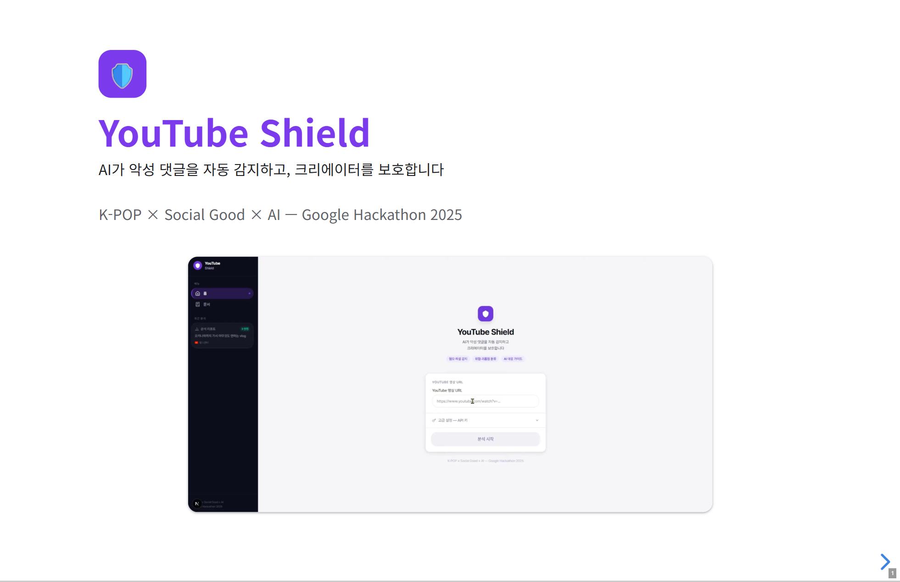
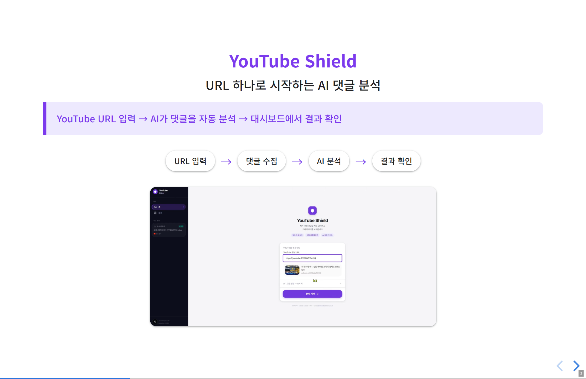
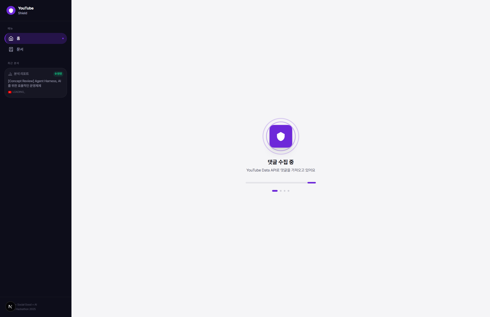
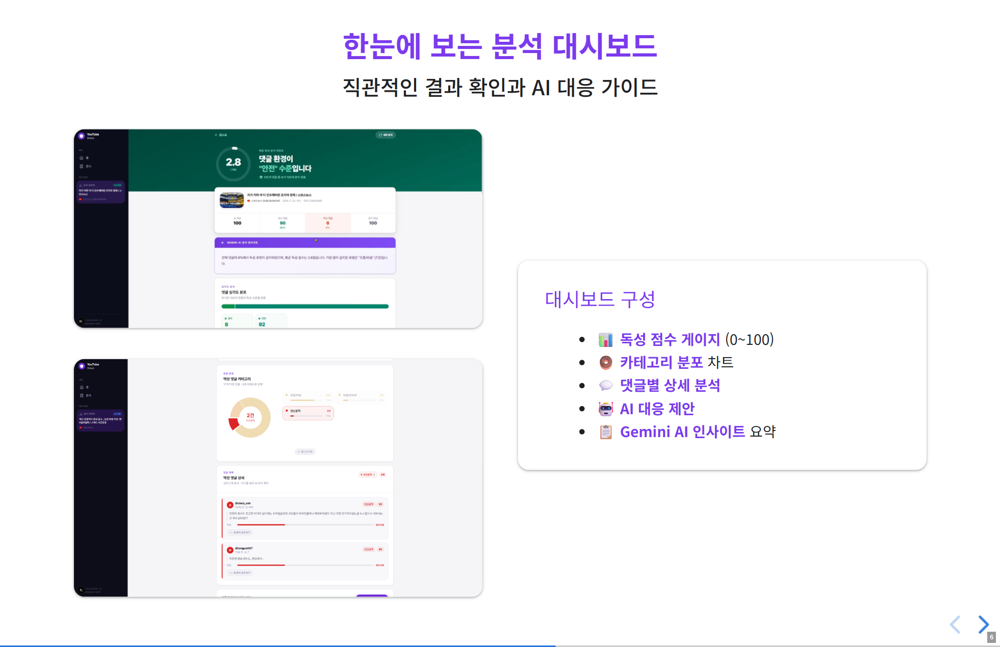

# Creator Hub — YouTube 악성 댓글 분석 서비스

Google Gemini Hackathon 출품작 (K-POP x Social Good x AI)

Gemini AI로 YouTube 댓글을 분석하여 악성 댓글을 자동 식별하고, 크리에이터에게 대응 방안을 제안하는 서비스입니다.

## 핵심 기술

- **Gemini 2.5 Flash** — 댓글 독성 분석 (한국어 특화, JSON 구조화 출력)
- **YouTube Data API v3** — 댓글/영상 정보 수집
- **Next.js 16** — 풀스택 프레임워크 (App Router + API Routes)

## 서비스 화면

### 메인 화면

YouTube 영상 URL을 입력하여 댓글 분석을 시작할 수 있습니다.



### URL 입력 & 영상 미리보기

URL을 입력하면 해당 영상의 썸네일과 제목을 미리 확인할 수 있습니다.



### 분석 진행

혐오·욕설·위협 등 7가지 유형으로 댓글 패턴을 감지합니다.



### 분석 리포트

독성 점수, 심각도 분포, Gemini AI 인사이트 등 종합 분석 결과를 제공합니다.



## 실행 방법

```bash
cd frontend && npm install && npm run dev
```

## 환경변수

프로젝트 루트 `.env` 파일에 설정:

```bash
YOUTUBE_API_KEY=your_youtube_api_key
GOOGLE_API_KEY=your_google_api_key
GEMINI_MODEL=gemini-2.5-flash
```

자세한 내용은 [AGENT.md](AGENT.md) 참조.
