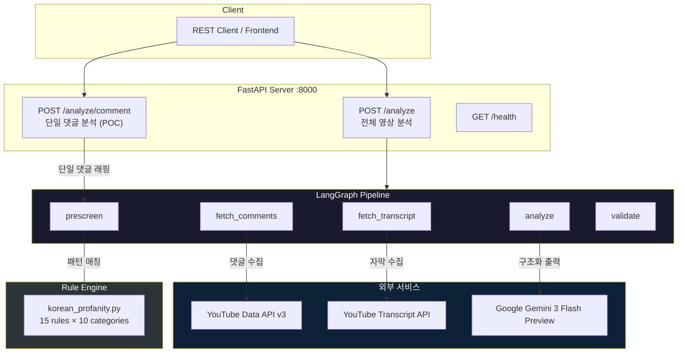
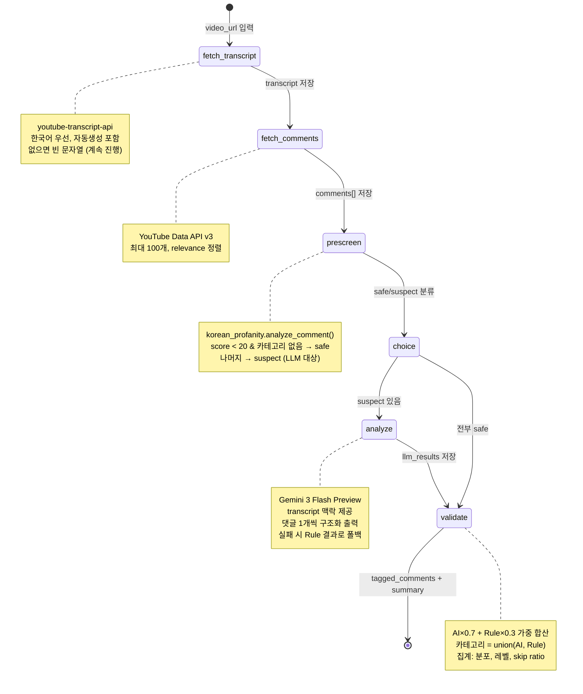
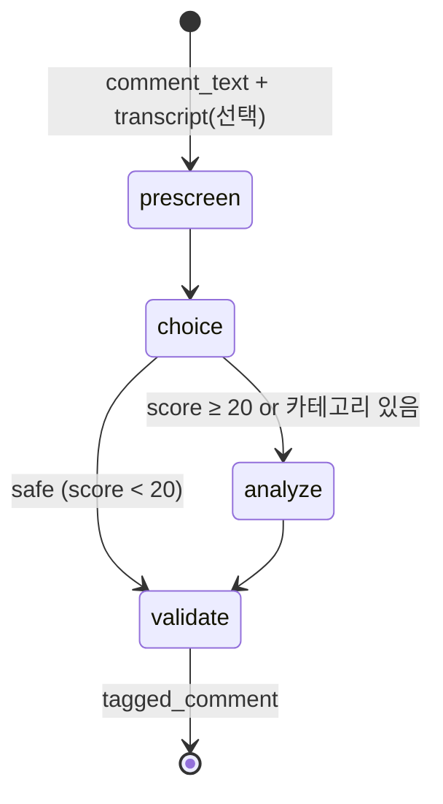
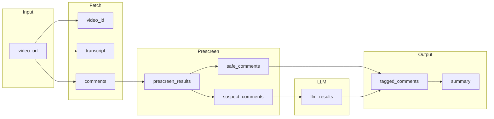
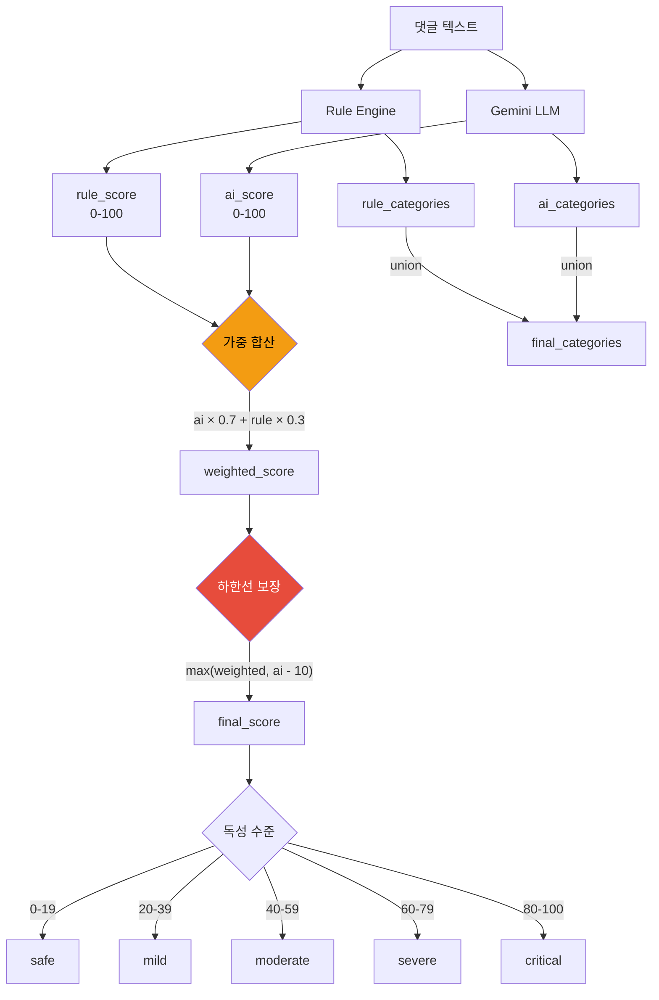
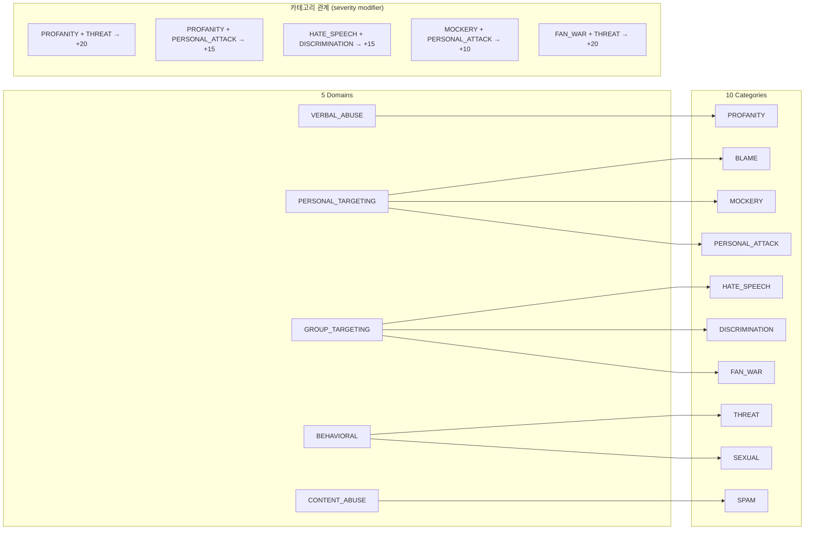

# Backend Architecture — 악성 댓글 태깅 파이프라인

## 시스템 개요

LangGraph + FastAPI 기반 백엔드. YouTube 영상의 자막(transcript)을 맥락으로 활용하여
댓글을 Rule 엔진과 Gemini LLM으로 이중 분석 후 독성 태깅.

**왜 이중 분석인가?**

- **Rule 엔진** — 정규식 기반. "ㅅㅂ", "시1발" 같은 명확한 패턴은 AI 없이도 즉시 탐지. 빠르고 비용 0.
- **Gemini LLM** — "와 진짜 잘하신다~ㅋㅋ" 같은 반어법, 맥락 의존적 조롱은 AI만 잡을 수 있음.
- **둘을 조합** — Rule이 명확한 건 빠르게 처리하고, 애매한 건 AI에 넘김. API 비용 40-60% 절감.

---

## 서비스 아키텍처



**구성 요소 설명:**

| 레이어 | 역할 | 기술 |
|--------|------|------|
| **Client** | API 호출자. 프론트엔드, curl, Postman 등 | HTTP/JSON |
| **FastAPI** | REST 엔드포인트 제공. 요청 검증, 응답 직렬화 | FastAPI + Pydantic |
| **LangGraph** | 분석 파이프라인 오케스트레이션. 노드 간 상태 전달, 조건부 분기 | LangGraph StateGraph |
| **Rule Engine** | 한국어 정규식 기반 독성 탐지. 15개 규칙, 10개 카테고리 | `scripts/korean_profanity.py` |
| **외부 서비스** | YouTube 자막/댓글 수집 + Gemini AI 분석 | Google APIs |

---

## LangGraph 파이프라인 플로우

### 전체 영상 분석 (`POST /analyze`)

사용자가 YouTube URL을 보내면, 5단계 파이프라인이 순차 실행된다.



**각 노드 상세:**

#### 1. `fetch_transcript` — 영상 자막 수집

- `youtube-transcript-api` 라이브러리로 자막 텍스트를 가져온다.
- 한국어(`ko`) 우선, 없으면 영어(`en`), 자동생성 자막도 포함.
- 자막이 아예 없는 영상이면 빈 문자열을 반환하고 파이프라인은 계속 진행.
- **용도**: 이후 LLM 분석 시 "이 영상이 어떤 내용인지" 맥락으로 제공.
  예) 영상이 정치 토론이면 "빨갱이"가 혐오인지 인용인지 판단 가능.

#### 2. `fetch_comments` — 댓글 수집

- YouTube Data API v3의 `commentThreads.list`로 댓글 최대 100개를 가져온다.
- `order=relevance` — YouTube가 판단한 관련성순 (좋아요 수, 답글 수 등 반영).
- 각 댓글: `comment_id`, `author`, `text`, `published_at`, `like_count`.

#### 3. `prescreen` — Rule 기반 사전 필터링

이 단계의 핵심: **AI 호출이 필요 없는 댓글을 걸러낸다.**

- `scripts/korean_profanity.py`의 `analyze_comment(text)`를 각 댓글에 실행.
- 15개 정규식 규칙으로 패턴 매칭 (초성 욕설, 변형 욕설, 위협 표현 등).
- 결과에 따라 댓글을 두 그룹으로 분류:

| 조건 | 분류 | 다음 단계 |
|------|------|-----------|
| `score < 20` AND 카테고리 없음 | **safe** | LLM 스킵, 바로 validate |
| `score >= 20` OR 카테고리 있음 | **suspect** | LLM 분석 대상 |

- 일반적으로 전체 댓글의 40-60%가 safe로 분류되어 **Gemini API 비용 절반 절감**.

#### 4. `analyze` — Gemini LLM 분석

suspect 댓글만 Gemini에 보낸다. **POC에서는 1개씩 호출.**

- 시스템 프롬프트: 10개 카테고리 정의, 한국어 특화 탐지 규칙, 점수 기준 포함.
- 사용자 프롬프트: `[영상 자막 맥락] + [분석 대상 댓글]` 형식.
- `with_structured_output(CommentTagging)` — Pydantic 모델로 강제 JSON 응답:
  - `toxicity_score` (0-100), `toxicity_level`, `categories[]`, `explanation`, `suggestion`
- **폴백**: LLM 호출 실패 시 (API 키 없음, 네트워크 오류 등) Rule 결과만 사용.

#### 5. `validate` — 교차검증 + 최종 태깅

Rule과 LLM 결과를 합쳐서 최종 점수를 산출한다.

- **safe 댓글**: Rule 점수 그대로 사용. `analysis_source: "rule_only"`.
- **suspect 댓글**: Rule + LLM 가중 합산 (아래 "점수 산정 로직" 참조).
- 최종 `tagged_comments[]`와 `summary` (집계 통계) 생성.

---

### 단일 댓글 분석 (`POST /analyze/comment`)

POC용 간소화 파이프라인. YouTube API 호출 없이 댓글 텍스트를 직접 받는다.



- `fetch_transcript`, `fetch_comments` 노드가 없음 — 입력으로 직접 제공.
- `transcript`는 선택 파라미터. 있으면 LLM이 맥락으로 활용.
- 나머지 로직 (prescreen → conditional → analyze → validate)은 동일.

---

## 데이터 흐름 (State)

LangGraph의 `PipelineState`는 TypedDict로 정의된다.
각 노드는 state의 일부를 읽고, 새 필드를 추가하여 다음 노드에 전달한다.



**State 필드별 설명:**

| 단계 | 필드 | 타입 | 설명 |
|------|------|------|------|
| Input | `video_url` | `str` | 사용자가 입력한 YouTube URL |
| Fetch | `video_id` | `str` | URL에서 추출한 11자 video ID |
| | `transcript` | `str` | 영상 자막 전체 텍스트 (없으면 빈 문자열) |
| | `comments` | `CommentRaw[]` | YouTube에서 수집한 원본 댓글 목록 |
| Prescreen | `prescreen_results` | `PrescreenResult[]` | 각 댓글의 Rule 분석 결과 (score, categories, patterns) |
| | `safe_comments` | `CommentRaw[]` | Rule에서 안전 판정된 댓글 (LLM 스킵 대상) |
| | `suspect_comments` | `CommentRaw[]` | LLM 분석이 필요한 댓글 |
| LLM | `llm_results` | `dict[]` | Gemini가 반환한 구조화 분석 결과 |
| Output | `tagged_comments` | `TaggedComment[]` | 최종 태깅 완료된 전체 댓글 |
| | `summary` | `dict` | 집계 통계 (독성 비율, 카테고리 분포, skip ratio 등) |

---

## 점수 산정 로직

suspect 댓글에 대해 Rule과 LLM 결과를 어떻게 합치는가.



**가중치가 AI 70% / Rule 30%인 이유:**

- AI(Gemini)는 문맥, 반어법, 은유를 이해한다. "와 진짜 잘하신다~ㅋㅋ"가 조롱인지 칭찬인지 판단.
- Rule은 패턴이 명확한 것만 잡는다. "ㅅㅂ"는 100% 욕설이지만, 미묘한 표현은 놓침.
- **AI가 주도하되, Rule의 확실한 탐지가 무시되지 않도록** 30% 반영.

**하한선 보장 (`max(weighted, ai_score - 10)`):**

- Rule 점수가 0인데 AI가 80이면, 가중 합산은 `80×0.7 + 0×0.3 = 56`.
- 하한선 없으면 AI가 "매우 위험"으로 판단한 댓글이 "moderate"로 떨어짐.
- `max(56, 80-10) = 70` → AI 판단이 크게 깎이지 않도록 보장.

**카테고리 합산:**

- Rule이 `PROFANITY`를 잡고, AI가 `PERSONAL_ATTACK`을 잡으면 → 최종: `[PROFANITY, PERSONAL_ATTACK]`.
- 빠짐없이 union 처리. 중복은 제거.

**구체적 예시:**

| 댓글 | Rule 결과 | AI 결과 | 최종 |
|------|-----------|---------|------|
| "ㅅㅂ 진짜 못하네" | score=35, PROFANITY | score=55, PROFANITY+BLAME | score=49, moderate, [PROFANITY, BLAME] |
| "와 진짜 잘하신다~ㅋㅋ" | score=30, MOCKERY | score=45, MOCKERY | score=41, moderate, [MOCKERY] |
| "영상 잘 봤습니다" | score=0 (safe → LLM 스킵) | — | score=0, safe, rule_only |
| "죽여버린다 ㅋㅋ" | score=65, THREAT | score=75, THREAT+MOCKERY | score=72, severe, [THREAT, MOCKERY] |

---

## Rule Engine 상세

10개 카테고리 × 15개 탐지 규칙. `scripts/korean_profanity.py` 재사용.



**15개 탐지 규칙 목록:**

| Rule ID | 카테고리 | 탐지 대상 | 점수 | 신뢰도 |
|---------|----------|-----------|------|--------|
| PROF_CHOSUNG | PROFANITY | 초성 욕설 (ㅅㅂ, ㅈㄹ, ㄱㅅㄲ) | 35 | high |
| PROF_MORPHED | PROFANITY | 변형 욕설 (시1발, 씨빠, ㅂr보) | 40 | high |
| PROF_DIRECT | PROFANITY | 직접 욕설 (시발, 병신, 지랄) | 50 | high |
| MOCK_SARCASM | MOCKERY | 반어법/비꼼 (와 잘하신다~, ㅋ×10+) | 30 | medium |
| MOCK_CONSUMER | MOCKERY | 소비자 비하 (호구, 흑우) | 30 | medium |
| THREAT_VIOLENCE | THREAT | 위협 (죽어, 찾아간다, 신상 턴다) | 65 | high |
| PA_DIRECT | PERSONAL_ATTACK | 인신공격 (못생김, 관종, 찐따) | 50 | high |
| PA_BELITTLE | PERSONAL_ATTACK | 비하 (한심, 멍청, 바보, 노답) | 35 | medium |
| BLAME_PATTERN | BLAME | 비난 (~해서 망한, 이래서 안되는) | 30 | medium |
| FW_PATTERN | FAN_WAR | 팬덤갈등 (빠순이, 사생팬, 탈덕) | 35 | medium |
| HS_GENDER | HATE_SPEECH | 성별혐오 (한남, 김치녀, ~충) | 55 | high |
| HS_POLITICAL | HATE_SPEECH | 정치비하 (빨갱이, 수꼴, 좌좀) | 45 | high |
| DISCRIM_PATTERN | DISCRIMINATION | 지역/학력 차별 (촌놈, 전라도) | 45 | medium |
| DISCRIM_GENERATION | DISCRIMINATION | 세대혐오 (꼰대, 틀딱, 잼민이) | 40 | medium |
| SPAM_LINK | SPAM | 광고/홍보 (링크, 구독해주세요) | 20 | medium |

**오탐 방지 (negative patterns):**

- THREAT: "죽어도 안 해" (관용구) → 제외
- HATE_SPEECH: "한남동" (지명), "한남자" → 제외
- MOCKERY: ㅋ 5개 → 10개로 상향 (일반 웃음 vs 조롱 구분)

**카테고리 관계 (co-occurrence bonus):**

한 댓글에 여러 카테고리가 동시 탐지되면 심각도가 올라간다.
예) "ㅅㅂ 찾아간다" → PROFANITY(35) + THREAT(65) → 관계 보너스 +20 → 최종 85 (critical).

---

## 디렉토리 구조

```
backend/
├── main.py                    # FastAPI 앱 + 엔드포인트
├── config.py                  # Settings (env vars, thresholds)
├── ARCHITECTURE.md            # ← 이 문서
│
├── graph/                     # LangGraph 파이프라인
│   ├── state.py               # PipelineState (TypedDict)
│   ├── pipeline.py            # StateGraph 조립 (2개: 전체/단일)
│   └── nodes/
│       ├── fetch.py           # YouTube transcript + comments 수집
│       ├── prescreen.py       # Rule pre-screen (korean_profanity 연동)
│       ├── analyze.py         # Gemini LLM 구조화 출력
│       └── validate.py        # Rule↔LLM 교차검증 + 최종 태깅
│
├── llm/                       # LLM 모듈
│   ├── gemini.py              # ChatGoogleGenerativeAI 설정
│   ├── prompts.py             # 시스템 프롬프트 (한국어, transcript 맥락)
│   └── schemas.py             # CommentTagging Pydantic 모델
│
└── models/
    └── schemas.py             # FastAPI 요청/응답 모델
```

---

## API 엔드포인트

| Method | Path | 설명 | 입력 | 출력 |
|--------|------|------|------|------|
| POST | `/analyze` | 전체 영상 분석 | `{ video_url }` | `{ video_id, transcript_length, tagged_comments[], summary }` |
| POST | `/analyze/comment` | 단일 댓글 (POC) | `{ comment_text, transcript? }` | `{ tagged_comment }` |
| GET | `/health` | 헬스체크 | - | `{ status: "ok" }` |

**`/analyze` 응답 예시:**

```json
{
  "video_id": "dQw4w9WgXcQ",
  "transcript_length": 1523,
  "total_comments": 100,
  "tagged_comments": [
    {
      "comment_id": "abc123",
      "author": "@user1",
      "text": "ㅅㅂ 진짜 못하네",
      "toxicity_score": 49,
      "toxicity_level": "moderate",
      "categories": ["PROFANITY", "BLAME"],
      "explanation": "초성 욕설(ㅅㅂ)과 능력 비하가 결합된 악성 댓글",
      "suggestion": "댓글 숨기기를 권장합니다",
      "analysis_source": "llm+rule"
    }
  ],
  "summary": {
    "total_comments": 100,
    "toxic_comments": 23,
    "toxic_percentage": 23.0,
    "average_toxicity_score": 12.5,
    "category_distribution": { "PROFANITY": 15, "MOCKERY": 8, "BLAME": 5 },
    "level_distribution": { "safe": 77, "mild": 12, "moderate": 8, "severe": 2, "critical": 1 },
    "pipeline_stats": {
      "rule_skipped": 62,
      "llm_analyzed": 38,
      "skip_ratio": 62.0
    }
  }
}
```

---

## 환경 변수

| 변수 | 필수 | 용도 | 비고 |
|------|------|------|------|
| `YOUTUBE_API_KEY` | `/analyze` 사용 시 | YouTube Data API v3 | 댓글 수집에 필요 |
| `GOOGLE_API_KEY` | LLM 분석 시 | Gemini API | 없으면 Rule-only 폴백 |
| `GEMINI_MODEL` | 아니오 | 모델명 (기본: `gemini-3-flash-preview`) | 비용/속도 조절 가능 |

---

## 실행

```bash
# 의존성 설치
uv sync

# 서버 시작
uv run uvicorn backend.main:app --reload --port 8000

# Swagger UI (API 문서 + 테스트)
open http://localhost:8000/docs

# 단일 댓글 테스트
curl -X POST localhost:8000/analyze/comment \
  -H "Content-Type: application/json" \
  -d '{"comment_text": "ㅅㅂ 진짜 못하네"}'

# 전체 영상 분석 (YOUTUBE_API_KEY + GOOGLE_API_KEY 필요)
curl -X POST localhost:8000/analyze \
  -H "Content-Type: application/json" \
  -d '{"video_url": "https://youtube.com/watch?v=..."}'
```
